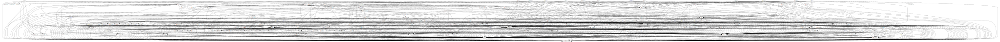
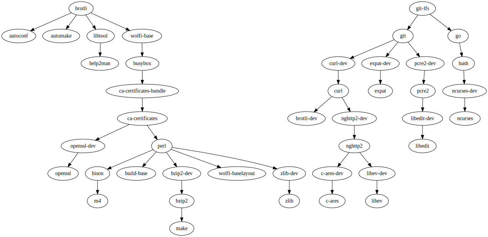
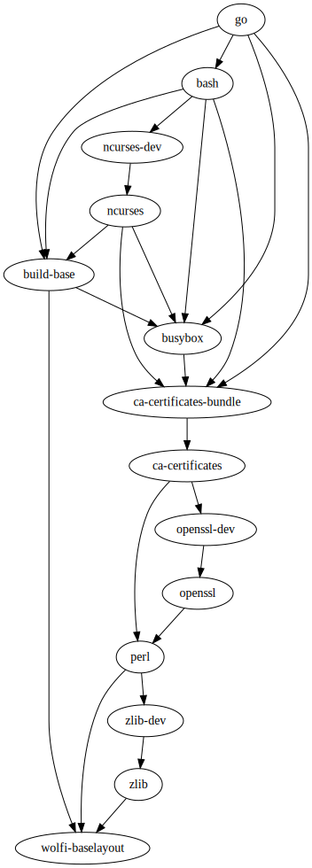
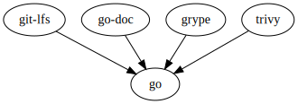

# `dag`

[](https://github.com/wolfi-dev/dag/actions/workflows/build.yaml)

`dag` generates Graphviz digraphs for Melange package dependencies.

## Install

```
go install github.com/wolfi-dev/dag@main
```

## Usage

To generate the full `dag.svg` of all build-time dependencies, run this inside the root of the [Wolfi OS](https://github.com/wolfi-dev/os) repo:

```
dag svg
```



### Subgraphs

`dag` can also generate subgraphs for only some packages.

To generate a graph for only one package:

```
dag svg brotli
```

To generate a graph for only some packages:

```
dag svg brotli attr
```



### Melange Directory

By default `dag` looks for Melange configs in the current directory.

It can look in another directory with the `--dir` or `-d` flag:

```
dag svg -d ../wolfi-dev/
```

### Output File

`dag` writes a file called `dag.svg` by default.

To change this, pass the `--out` or `-o` flag:

```
dag svg -o brotli.svg brotli
```

It will only generate SVG.

### Text Output

`dag text` can write a sorted list of downstream packages for a set of given packages.

```
dag text brotli
...
packages/x86_64/brotli-1.0.9-r0.apk
packages/x86_64/autoconf-2.71-r0.apk
packages/x86_64/build-base-1-r3.apk
packages/x86_64/busybox-1.35.0-r3.apk
packages/x86_64/ca-certificates-bundle-20220614-r2.apk
```

This can be fed to `make` to build only downstream packages of a package.

### Dependencies vs. dependents

By default, the `dag svg ...` and `dag text ...` commands show you the **_dependencies_** of the package(s) you supply as arguments to the command.

For example, running `dag svg go` will show you the packages that `go` depends on at build-time:



To look instead at the packages that are **_dependent on_** the package(s) you supply, use the `--show-dependents` (or `-D`) flag.

For example, running `dag svg go -D` will show you the packages that depend on `go` at build-time:


